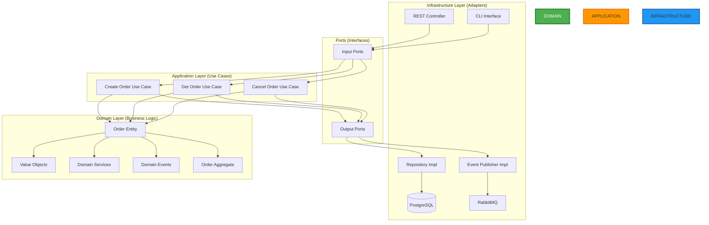

# 🏗️ Java Hexagonal Architecture with DDD

[](https://www.oracle.com/java/)
[](https://spring.io/projects/spring-boot)
[](https://alistair.cockburn.us/hexagonal-architecture/)
[](https://martinfowler.com/bliki/DomainDrivenDesign.html)

> Enterprise Java application implementing Hexagonal Architecture (Ports & Adapters), Domain-Driven Design, and SOLID principles for maximum maintainability and testability.

---

## 🎯 What is this Project?

This project is a **showcase of advanced software architecture patterns in Java**, designed to demonstrate expertise in building scalable, maintainable enterprise systems.

### Key Architectural Patterns

- ✅ **Hexagonal Architecture** (Ports & Adapters)
- ✅ **Domain-Driven Design** (DDD)
- ✅ **CQRS** (Command Query Responsibility Segregation)
- ✅ **Event Sourcing**
- ✅ **SOLID Principles**
- ✅ **Clean Code Practices**

---

## 🏛️ Architecture Layers



---

## ✨ Features

### 🎯 Domain Layer (Core Business Logic)
- ✅ **Entities** with rich behavior
- ✅ **Value Objects** for immutability
- ✅ **Aggregates** with consistency boundaries
- ✅ **Domain Events** for decoupling
- ✅ **Domain Services** for complex logic
- ✅ **Specifications** for business rules

### 🔌 Application Layer (Use Cases)
- ✅ **Input Ports** (interfaces for use cases)
- ✅ **Output Ports** (interfaces for infrastructure)
- ✅ **Use Case** implementations
- ✅ **DTOs** for data transfer
- ✅ **Commands & Queries** (CQRS)

### 🔧 Infrastructure Layer (Adapters)
- ✅ **REST API** adapter (Spring MVC)
- ✅ **Repository** adapter (JPA)
- ✅ **Event Publisher** adapter (RabbitMQ)
- ✅ **CLI** adapter (Spring Shell)
- ✅ **Configuration**

---

## 📁 Project Structure

```
java-hexagonal-architecture-ddd/
├── src/
│   ├── main/
│   │   └── java/
│   │       └── com/
│   │           └── davidbadell/
│   │               └── hexagonal/
│   │                   ├── HexagonalApplication.java
│   │                   │
│   │                   ├── domain/                    # CORE (No dependencies)
│   │                   │   ├── model/
│   │                   │   │   ├── Order.java         # Aggregate Root
│   │                   │   │   ├── OrderLine.java     # Entity
│   │                   │   │   ├── OrderId.java       # Value Object
│   │                   │   │   ├── Money.java         # Value Object
│   │                   │   │   └── OrderStatus.java   # Enum
│   │                   │   ├── service/
│   │                   │   │   └── PricingService.java
│   │                   │   ├── event/
│   │                   │   │   ├── OrderCreatedEvent.java
│   │                   │   │   └── OrderCancelledEvent.java
│   │                   │   └── exception/
│   │                   │       └── DomainException.java
│   │                   │
│   │                   ├── application/               # USE CASES
│   │                   │   ├── port/
│   │                   │   │   ├── in/               # Input Ports
│   │                   │   │   │   ├── CreateOrderUseCase.java
│   │                   │   │   │   ├── GetOrderUseCase.java
│   │                   │   │   │   └── CancelOrderUseCase.java
│   │                   │   │   └── out/              # Output Ports
│   │                   │   │       ├── OrderRepository.java
│   │                   │   │       └── EventPublisher.java
│   │                   │   ├── service/
│   │                   │   │   ├── CreateOrderService.java
│   │                   │   │   ├── GetOrderService.java
│   │                   │   │   └── CancelOrderService.java
│   │                   │   └── dto/
│   │                   │       ├── CreateOrderCommand.java
│   │                   │       ├── OrderQuery.java
│   │                   │       └── OrderResponse.java
│   │                   │
│   │                   └── infrastructure/            # ADAPTERS
│   │                       ├── adapter/
│   │                       │   ├── in/
│   │                       │   │   ├── rest/
│   │                       │   │   │   └── OrderController.java
│   │                       │   │   └── cli/
│   │                       │   │       └── OrderCLI.java
│   │                       │   └── out/
│   │                       │       ├── persistence/
│   │                       │       │   ├── OrderJpaRepository.java
│   │                       │       │   ├── OrderEntity.java
│   │                       │       │   └── OrderRepositoryAdapter.java
│   │                       │       └── messaging/
│   │                       │           └── EventPublisherAdapter.java
│   │                       └── config/
│   │                           ├── BeanConfiguration.java
│   │                           └── SecurityConfiguration.java
│   │
│   └── test/
│       └── java/
│           └── com/
│               └── davidbadell/
│                   └── hexagonal/
│                       ├── domain/
│                       │   └── OrderTest.java
│                       ├── application/
│                       │   └── CreateOrderServiceTest.java
│                       └── architecture/
│                           └── ArchitectureTest.java  # ArchUnit tests
```

---

## 🔑 Key Concepts

### Dependency Rule

```
Infrastructure → Application → Domain

The Domain layer has NO dependencies on outer layers.
Dependencies point INWARD only.
```

### Hexagonal Architecture Principles

1. **Business Logic Independence**
   - Domain layer has zero external dependencies
   - Pure Java POJOs in domain

2. **Ports & Adapters**
   - Ports = Interfaces
   - Adapters = Implementations

3. **Dependency Inversion**
   - High-level modules don't depend on low-level modules
   - Both depend on abstractions

4. **Testability**
   - Domain logic testable without infrastructure
   - Easy to mock adapters

---

## 🛠️ Technology Stack

| Layer | Technology | Purpose |
|-------|-----------|---------|
| **Domain** | Pure Java 17 | Business logic |
| **Application** | Java 17 | Use cases |
| **Infrastructure - Web** | Spring MVC | REST API |
| **Infrastructure - Persistence** | Spring Data JPA | Database |
| **Infrastructure - Messaging** | RabbitMQ | Events |
| **Database** | PostgreSQL | Data storage |
| **Testing** | JUnit 5 + Mockito | Unit tests |
| **Architecture Testing** | ArchUnit | Architecture validation |
| **Build** | Maven | Dependency management |

---

## 📦 Installation

```bash
# Clone repository
git clone https://github.com/davidbadelllab/java-hexagonal-architecture-ddd.git
cd java-hexagonal-architecture-ddd

# Build
mvn clean install

# Run
mvn spring-boot:run

# Or with Docker
docker-compose up --build
```

---

## 🚀 Usage Examples

### REST API

```bash
# Create Order
curl -X POST http://localhost:8080/api/orders \
  -H "Content-Type: application/json" \
  -d '{
    "customerId": "customer-123",
    "items": [
      {
        "productId": "product-1",
        "quantity": 2,
        "price": 29.99
      }
    ]
  }'

# Get Order
curl http://localhost:8080/api/orders/{orderId}

# Cancel Order
curl -X POST http://localhost:8080/api/orders/{orderId}/cancel
```

### CLI Commands

```bash
# Create order via CLI
java -jar target/app.jar order create --customer customer-123

# List orders
java -jar target/app.jar order list

# Cancel order
java -jar target/app.jar order cancel --id {orderId}
```

---

## 🧪 Testing

### Unit Tests (Domain Layer)

```java
@Test
void whenAddingItem_thenTotalIsCalculated() {
    // Given
    Order order = new Order(new OrderId("123"), new CustomerId("cust-1"));
    OrderLine item = new OrderLine(
        new ProductId("prod-1"),
        new Quantity(2),
        new Money(BigDecimal.valueOf(29.99))
    );

    // When
    order.addItem(item);

    // Then
    assertThat(order.getTotal()).isEqualTo(new Money(BigDecimal.valueOf(59.98)));
}
```

### Integration Tests

```java
@SpringBootTest
@Testcontainers
class CreateOrderIntegrationTest {

    @Container
    static PostgreSQLContainer<?> postgres = new PostgreSQLContainer<>("postgres:15");

    @Autowired
    private CreateOrderUseCase createOrderUseCase;

    @Test
    void shouldCreateOrderSuccessfully() {
        // Test use case with real infrastructure
    }
}
```

### Architecture Tests (ArchUnit)

```java
@AnalyzeClasses(packages = "com.davidbadell.hexagonal")
class ArchitectureTest {

    @ArchTest
    static final ArchRule domainShouldNotDependOnInfrastructure =
        classes().that().resideInAPackage("..domain..")
            .should().onlyDependOnClassesThat()
            .resideInAnyPackage("..domain..", "java..");

    @ArchTest
    static final ArchRule applicationShouldNotDependOnInfrastructure =
        classes().that().resideInAPackage("..application..")
            .should().notDependOnClassesThat()
            .resideInAPackage("..infrastructure..");
}
```

---

## 📚 DDD Patterns Implemented

### Strategic Design

- ✅ **Bounded Contexts** - Order Management context
- ✅ **Ubiquitous Language** - Business terms in code
- ✅ **Context Mapping** - Integration patterns

### Tactical Design

- ✅ **Entities** - Objects with identity
- ✅ **Value Objects** - Immutable descriptors
- ✅ **Aggregates** - Consistency boundaries
- ✅ **Domain Events** - State changes
- ✅ **Repositories** - Collection abstraction
- ✅ **Domain Services** - Stateless operations
- ✅ **Specifications** - Business rules

---

## 🎓 Learning Resources

### Books
- "Domain-Driven Design" - Eric Evans
- "Implementing Domain-Driven Design" - Vaughn Vernon
- "Clean Architecture" - Robert C. Martin
- "Get Your Hands Dirty on Clean Architecture" - Tom Hombergs

### Articles
- [Hexagonal Architecture](https://alistair.cockburn.us/hexagonal-architecture/)
- [DDD Reference](https://www.domainlanguage.com/ddd/reference/)
- [SOLID Principles](https://en.wikipedia.org/wiki/SOLID)

---

## 🏆 Benefits of This Architecture

### For Business
- ✅ **Faster time to market** - Business logic is isolated
- ✅ **Reduced maintenance costs** - High cohesion, low coupling
- ✅ **Technology independence** - Easy to swap frameworks
- ✅ **Easier onboarding** - Clear structure

### For Developers
- ✅ **Highly testable** - Mock external dependencies easily
- ✅ **Maintainable** - Clear separation of concerns
- ✅ **Extensible** - Add new adapters without changing core
- ✅ **Technology agnostic** - Domain doesn't know about Spring

---

## 🗺️ Roadmap

- [ ] Add SAGA pattern for distributed transactions
- [ ] Implement Event Sourcing completely
- [ ] Add GraphQL adapter
- [ ] Kotlin version
- [ ] gRPC adapter
- [ ] MongoDB adapter example
- [ ] Reactive implementation with WebFlux

---

## 👨‍💻 Author

**David Badell** - Software Architect
- GitHub: [@davidbadelllab](https://github.com/davidbadelllab)
- Email: davidbadell42@gmail.com

This project demonstrates mastery of:
- ✅ Hexagonal Architecture
- ✅ Domain-Driven Design
- ✅ SOLID Principles
- ✅ Clean Code
- ✅ Enterprise Java Patterns

---

<div align="center">

**⭐ If this architecture helped you understand DDD and Hexagonal Architecture, star it! ⭐**


</div>
